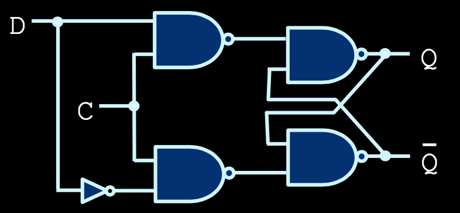

#  CSC258 Review

# LECTURE 1
## Transistors
Logic Gates are made from transistors based on pn-junctions made from semiconductors that conduct electricity

### Semiconductors
Si and Ge

#### Impurity (Doping)

##### n-type
Add Phosphorus

##### p-type
Add Boron

##### p-n Junctions
Elec from n section fill holes in p section, cancelling each other-> Depletion layer (no free carriers).
Doping atoms that remain create an electric field. 
Diffusion: Electrons initial movement (attracted by holes) -> increase width of depletion layer.
Drift: Electrons movement drawn by electric field -> decrease width of depletion layer.
Eventually equilibrium -> certain width reached.

#### Apply Voltage to PN-Junction
Forward Bias: Positive voltage to P -> depletion layer narrower -> easy to travel therefore like switch is CONNECTED
Reverse Bias: Positive voltage to N -> depletion layer wider -> hard to travel therefore like switch is DISCONNECTED

#### MOSFET
Metal Oxide Semiconductor Field Effect Transistors

##### nMOS
nMOS conduct when +ve voltage (5V) applied (carriers are electrons), N-P-N

##### pMOS
pMOS conduct when -ve voltage (0V) applied (carriers are holes), P-N-P

### Logic Gates
Are made by a combination of pMOS and nMOS Transistors. pMOS transistors conduct logic-1 values batter, and nMOS transistors conduct logic-0 values batter.

#### Gates Truth Table

| A    | B    | AND  | OR   | XOR  | NAND |
| :--: | :--: | :--: | :--: | :--: | :--: |
| 0    | 0    | 0    | 0    | 0    | 1    |
| 0    | 1    | 0    | 1    | 1    | 1    |
| 1    | 0    | 0    | 1    | 1    | 1    |
| 1    | 1    | 1    | 1    | 0    | 0    |

#### Creating complex logic
1.  Create truth tables
2.  Express as boolean expression
3.  Convert to Gates

#### Minterms and Maxterms
(For MINTERM: 0 and 1 represents X' and X respectively for an input X)
(For MAXTERM: 0 and 1 represents X and X' respectively for an input X)
| Maxterm       | Minterm       | A             | B             | C             |
| :-----------: | :-----------: | :-----------: | :-----------: | :-----------: |
| M<sub>0</sub> | m<sub>0</sub> | 0             | 0             | 0             |
| M<sub>1</sub> | m<sub>1</sub> | 0             | 0             | 1             |
| M<sub>2</sub> | m<sub>2</sub> | 0             | 1             | 0             |
| M<sub>3</sub> | m<sub>3</sub> | 0             | 1             | 1             |
| M<sub>4</sub> | m<sub>4</sub> | 1             | 0             | 0             |
| M<sub>5</sub> | m<sub>5</sub> | 1             | 0             | 1             |
| M<sub>6</sub> | m<sub>6</sub> | 1             | 1             | 0             |
| M<sub>7</sub> | m<sub>7</sub> | 1             | 1             | 1             |

m<sub>x</sub> == M<sub>x</sub>'

##### Minterm
An __AND__ expression with every input present in true or complemented form
Each minterm corrosponds to single HIGH output in table. SOP (Sum of Products).

###### Valid minterms:
A · B' · C · D, A' · B · C' · D, A · B · C · D

###### Sum-of-Minterms (SOM)
__Union__ of minterm expressions. A way of expressing which inputs cause the output to go high.

##### Maxterm
An __OR__ expression with every input present in true or complemented form
Each maxterm corrosponds to single LOW output in table. POS (Product of Sums).

###### Valid maxterms:
A + B' + C + D, A' + B + C' + D, A + B + C + D

###### Product-of-Maxterms (POM)
__intersection__ of maxterm expressions.

#### Karnaugh Maps (K-Map)
2D grid of minterms, where adjacent minterm locations in the grid differ by a single literal. Use to find the simplest expresion for a circuit (lowest Gate Cost).

|                | C' · D'        | C' · D         | C · D          | C · D'         |
| :------------: | :------------: | :------------: | :------------: | :------------: |
| A' · B'        | m<sub>0</sub>  | m<sub>1</sub>  | m<sub>3</sub>  | m<sub>2</sub>  |
| A' · B         | m<sub>4</sub>  | m<sub>5</sub>  | m<sub>7</sub>  | m<sub>6</sub>  |
| A · B          | m<sub>12</sub> | m<sub>13</sub> | m<sub>15</sub> | m<sub>14</sub> |
| A · B'         | m<sub>8</sub>  | m<sub>9</sub>  | m<sub>11</sub> | m<sub>10</sub> |

Once maps are created, draw boxes over groups of high output values.
-   Boxes must be rectangular, and aligned with map.
-   Number of values contained within each box must be power of 2.
-   Boxes may overlap with each other
-   Boxes may wrap across edges of map
Minterms: group entries with 1. Maxterms: group entries with 0.

## Logical Devices
### Combinational Circuits
Multiplexers (MUX), decoders, Adders, Subtractors, Comparators. Any circuits where the outputs rely strictly on the inputs. Another category is _sequencial cirtuits_ :(.

#### Multiplexer
2-to-1 MUX: S = 0, M => X; S = 1, M => Y;

|  X  |  Y  |  S  |  M  |
| :-: | :-: | :-: | :-: |
|  0  |  0  |  0  |  0  |
|  0  |  0  |  1  |  0  |
|  0  |  1  |  0  |  0  |
|  0  |  1  |  1  |  1  |
|  1  |  0  |  0  |  1  |
|  1  |  0  |  1  |  0  |
|  1  |  1  |  0  |  1  |
|  1  |  1  |  1  |  1  |

4-to-1 MUX:

| _s<sub>1</sub>, s<sub>0</sub>_ | m                              |
| :----------------------------: | :----------------------------: |
| 00                             | u                              |
| 01                             | v                              |
| 10                             | w                              |
| 11                             | x                              |

Verilog code:

```verilog
module mux_logic( select, d, q );

input[1:0]  select;
input[3:0]  d;
output      q;

wire        q;
wire[1:0]   select;
wire[3:0]   d;

assign q =  (~select[1] & ~select[0])   & d[0] |
            (~select[1] & select[0])    & d[1] |
            (select[1]  & ~select[0])   & d[2] |
            (select[1]  & select[0])    & d[3] ;

endmodule
```

#### decoders
Translate from the output of one circuit to input of another.

##### 7-segment decoder
-   Translate from a 4-digit binary number to 7 segments of a digital display
-   each output segment has a particular logic

#### Adders
AKA Binary Adders
-   Small circuit devices that add two digits together

##### Half Adders
Adds two bits to produce a two-bit sum, as a sum bit and a carry bit.

```
C = X · Y

S = X · Y' + X' · Y
  = X ⊕ Y
```

##### Full Adders
Similar to Half adders, but with another input `Z`, which represents a carry-in bit (C and Z usually labeled as C<sub>out</sub> and C<sub>in</sub>)

```
C = X · Y + X · Z + Y · Z

S = X ⊕ Y ⊕ Z
```

##### Ripple-Carry Binary Adder
Full adder units chained together

#### Subtractors
1.  Take a smaller number, and invert all the digits
2.  Add inverted number to the larger one
3.  Add one to the result

(2's complement)

#### Signed numbers
##### Sign and Magnitude
Sign: A separate bit for the sign, __0 for +, 1 for -__.

Magnitude： Remaining bits store unsigned part of the number.

e.g. 0110 if 6 while 1110 is -6


##### 2's complement
###### 1's complement
(2<sup>n</sup>-1)-x, negate each individual bit.
###### 2's complement is 1's complement + 1
(Adding a -tive umber in 2's complement notation to the same positive number reduces a result of 0)

circuit implementation:


##### Addition/Subtraction circuit

`A XOR 0` is `A`, `A XOR 1` is `!A`. Therefore if `Sub` is high, `1` is `Cin` and input of `Y` is bitwise flipped.

#### Comparators
Bitwise comparison. Most significant bit domintes.

Verilog implementation:

```Verilog
module comparator_4_bit (a_gt_b, a_lt_b, a_eq_b, a, b);

input [3:0] a, b;
output a_gt_b, a_lt_b, a_eq_b;

assign a_gt_b = (a > b);
assign a_lt_b = (a < b);
assign a_eq_b = (a == b);

endmodule
```


### Sequential Circuits
Internal state can change over time, same input value can result different outputs

NAND, NOR gates with feedback have more interesting characteristics, which make them to storage devices.

Feedback circuit example:


NAND Behavior

| A                  | Q<sub>T</sub>      | Q<sub>T + 1</sub>  |
| :----------------: | :----------------: | :----------------: |
| 0                  | 0                  | 1                  |
| 0                  | 1                  | 1                  |
| 1                  | 0                  | 1                  |
| 1                  | 1                  | 0                  |

NOR Behavior

| A                  | Q<sub>T</sub>      | Q<sub>T + 1</sub>  |
| :----------------: | :----------------: | :----------------: |
| 0                  | 0                  | 1                  |
| 0                  | 1                  | 0                  |
| 1                  | 0                  | 0                  |
| 1                  | 1                  | 0                  |

Storage could enter unsteady states.

#### Latches
Latches are combination of multiple gates of these types.


##### `S'R'` latch

-   `S'` and `R'` are called "set" and "reset" respectively
-   Circuits "remembers" its signal when going from `10` or `01` to `11`.
-   Going from `00` to `11` produces unstable behavior, depending on which input changes first
-   __00__ is forbidden state

##### `SR` latch

-   `S` and `R` are called "set" and "reset" respectively
-   Circuits "remembers" previous output when going from `10` or `01` to `00`
-   Unstable behavior possible when inputs go from `11` to `00`
-   __11__ is forbidden state

###### Timing diagram
```
S   ▁▁▁▁▔▔▔▔▔▔▔▔▁▁▁▁▁▁▁▁▁▁▁▁
R   ▁▁▁▁▁▁▁▁▁▁▁▁▁▁▁▁▔▔▔▔▔▔▔▔
Q   ▁▁▁▁▁▁▁▁▔▔▔▔▔▔▔▔▔▔▁▁▁▁▁▁
Q'  ▔▔▔▔▔▔▁▁▁▁▁▁▁▁▁▁▁▁▁▁▔▔▔▔
```

Notation:
-   T<sub>PLH</sub>: Propagation time when output goes from Low to High
-   T<sub>PHL</sub>: Propagation time when output goes from High to Low

#### Clock
-   Timing signal to let circuit know when the output may be sampled
-   Periodic regular signal
-   Usually drawn as
```
    ┃ Voltage 5V
    ┃▁▔▁▔▁▔▁▔▁▔▁▔▁▔▁▔▁▔▁▔
    ┃ Voltage 0V
    ┗━━━━━━━━━━━━━━━━━━━━━> time
```

- frequency: How many pulses occur per second, measured in Hertz (Hz)

##### Clocked SR Latch


-   By adding another layer of NAND gates to the S'R' latch, we get a SR latch with control input
-   Input C is often connected to a pulse signal that alternates regularly between 0 and 1 (clock)
-   Behavior
    -   Clock need to be high in order for the inputs to take any Effect

Symbol
```
  ┏━━━━━━━┓
━━┫ S     ┣━━ Q
━━┫ C     ┃
━━┫ R     ┣○━ Q'
  ┗━━━━━━━┛
```
The NOT circil is not an extra NOT gate. We got this inversion for free.

##### D latch

```
  ┏━━━━━━━┓
━━┫ D     ┣━━ Q
━━┫ C     ┃
  ┃       ┣○━ Q'
  ┗━━━━━━━┛
```
-   By making `R` and `S` independent on a signal `D`, avoid the indeterminate state problem
-   Value of `D` sets output `Q` low or high when `C` is high
-   Timing issue
    -   Any changes to its inputs are visible to the output when control signal (clock) is 1
    -   output of a latch ___should not___ be applied directly or through combinational logic to the input of the same or another latch when they all have the same control signal

#### Flip-Flops
Triggered only on a edge of the clock

##### D Flip-Flop
###### Master-slave
A D-latch (master) is connected to an SR-latch (slave) with complementary control signals.
```
Negedge-triggered DFF
      ┏━━━━━━━┓          ┏━━━━━━━┓
D ━━━━┫ D   Q ┣━━━━━━━━━━┫ S1  Q ┣━━ Q
C ━━┳━┫ C     ┃    ┏━━━━━┫ C     ┃
    ┃ ┃     Q'┣○━━━╋━━━━━┫ R1  Q'┣○━ Q'
    ┃ ┗━━━━━━━┛    ┃     ┗━━━━━━━┛
    ┗━━━▷○━━━━━━━━━┛
```

```
Posedge-triggered DFF
       ┏━━━━━━━┓          ┏━━━━━━━┓
D ━━━━━┫ D   Q ┣━━━━━━━━━━┫ S1    ┣━━ Q
C ━▷○┳━┫ C     ┃    ┏━━━━━┫ C     ┃
     ┃ ┃     Q'┣○━━━╋━━━━━┫ R1    ┣○━ Q'
     ┃ ┗━━━━━━━┛    ┃     ┗━━━━━━━┛
     ┗━━━▷○━━━━━━━━━┛
```
Most commonly-used flip-flop

Verilog implementation

```verilog
reg [1:0] q;

always @ (posedge clk, negedge reset_n)
begin
    if (reset_n == 1'b0)
        q <= 2'b00;
    else
        q <= d;
end
```

##### Other Flip-Flops
###### T Flip-Flop
Toggles value whenever input T is high
-   If `T` is `1` @ posedge, output `Q` will toggle
-   If `T` is `0` @ negedge, output `Q` holds on prior state

###### JK Flip-Flop
-   If `J` and `K` are  `0`, maintain output
-   If `J` is `0` and `K` is `1`, set output to `0`
-   If `J` is `1` and `K` is `0`, set output to `1`
-   If `J` and `K` are `1`, toggle output value

##### Timing signal restrictions
-   Setup time: input should be stable for some time before active clock edge
-   Hold time: input should be stable for some time immediately after the active clock edge
-   Time period between two active clock edges cannot be shorter than __longest propagation delay__ between any two flip-flops + __setup time__ of the flip-flop

##### Reset inputs
-   A way to initialize flip-flop states
-   reset signal resets FF output to 0 (unrelated to R of SE latch)
-   Synchronous reset: only on posedge
-   Asynchronous reset: output is set to 0 immediately, independent of the clock signal
-   often also called __Clear__

### Sequential Circuit Design
#### Register
Allow storage of information (CPU has many physical registers)
##### Shift registers

A series of DFF can store a multi-bit value (e.g a 16-bit int)
-   Data can be shifted into this register one bit at a time, over 16 clock cycles

##### Load Registers

Load reg's values all at once (e.g. a 4-bit load reg)
-   To control when this reg is allowed to load value, use __DFF with enable__


```
  ┏━━━━━━━┓
━━┫ D   Q ┣━━ Q
━━┫ EN    ┃
━━┫ ▷   Q'┣○━ Q'
  ┗━━━━━━━┛
```

###### Register with Parallel Load

Maintain value in reg until overwritten by setting EN high

#### Counters
##### Asynchronous Counter
-   Connect output of one FF to the input of the next => ripple counter
-   Cheap to implement
-   Unreliable for Timing
##### Synchronous Counter
-   Avoids false counts by having all FFs connected to the same clock
-   Example: 3-bit Counter

| Q<sub>2</sub>      | Q<sub>1</sub>      | Q<sub>0</sub>      |
| :----------------: | :----------------: | :----------------: |
| 0                  | 0                  | 0                  |
| 0                  | 0                  | 1                  |
| 0                  | 1                  | 0                  |
| 0                  | 1                  | 1                  |
| 1                  | 0                  | 0                  |
| 1                  | 0                  | 1                  |
| 1                  | 1                  | 0                  |
| 1                  | 1                  | 1                  |

-   Q<sub>0</sub> => every cycle
-   Q<sub>1</sub> => When present state of Q<sub>0</sub> is 1
-   Q<sub>2</sub> => When present state of Q<sub>1</sub> is 1

### State Machine
Designing with flip-flops
-   Sequential circuits are the basis for memory, instruction processing and any other operation that requires the circuit to remember __past data values__
-   The __past data values__ are also called the __states__ of the circuit.
-   use combinational logic to determine what the __next state__ of the system should be, based on the __present state__ and __current input values__.

#### State tables
helps to illustrate how the state of the circuit change with various input values.

| Present State      | Enable             | Next State         |
| :----------------: | :----------------: | :----------------: |
| zero               | 0                  | zero               |
| zero               | 1                  | one                |
| one                | 0                  | one                |
| one                | 1                  | two                |
| two                | 0                  | two                |
| two                | 1                  | three              |
| three              | 0                  | three              |
| three              | 1                  | four               |
| four               | 0                  | four               |
| four               | 1                  | five               |
| five               | 0                  | five               |
| five               | 1                  | six                |
| six                | 0                  | six                |
| six                | 1                  | seven              |
| seven              | 0                  | seven              |
| seven              | 1                  | zero               |

#### Finite State Machines (FSM)
Models for actual circuit Design
-   A finite set of states
-   A finite set of transitions between states, triggered by inputs to the state machine
-   output values that are associated with each state or each transition
-   Start and end states for the state machine

Steps
1.  State diagram
2.  Derive state table from state diagram
3.  Assign FF to each state
4.  rewrite state table with FF values
5.  Circuit design (K-Map), derive combinational circuit for outputs and for each FF output

##### Implementation
###### Moore vs. FSM types
Moore:
-   output of FSM depend solely on the current FSM state
-   output can change only when state changes
-   in state diagram, outputs are drawn within each circle

Mealy:
-   output depend on the current FSM state and __the inputs__
-   output can change ass soon as the input changes even if state did not change
-   In state diagram, outputs are drawn on transition

```verilog
reg [1:0] present_state;

always @ (posedge clk, negedge reset_n)
begin
    if (reset_n == 1'b0)
        present_state <= 2'b00;
    else
        present_state <= next_state;
end
```

###### Combinational circuit A in verilog

```verilog
reg [1:0] present_state, next_state;

always @ (*)
    case (present_state)
        A: next_state = ...;
        ...
        default: next_state = ...;
    endcase
```

User symbolic names for states and not hard-coded constants>

```verilog
localparam [1:0] A = 2'b00, B = 2'b01;
```

###### State flip-flops

```verilog
always @ (posedge clock, negedge resetn)
begin
    if (resetn == 1'b0)
        present_state <= A;
    else
        present_state <= next_state
end
```

`present_state` is outputs `Q` of our flip-flops  
`next_state` is inputs `D` of out FF (outputs from combinational circuit A)

###### FSM's Outputs (Combinational Circuit B)
Implement either with assign statements or an `always @(*)` block

On Quartus, use __State Machine Viewer__ to observe state table and state diagram, and user __Technology Map Viewer__ to see function/truth table

###### One-Hot Assignment for FSM
-   need as many FFs as FSM states
-   given `n` FSM states, each state code will have `n-1` bits zero and `1` bit one
-   Simpler, faster logic due to simpler boolean expressions
-   Key points
    -   uniquely identify any state just by specifying the 1 flip-flop whose output will be high

### Midterm review
 Assume you have 5 bits, what is the range of numbers you can represent in 2’s complement?  
 -16 ~ 15 ?

## Processor

-   `PC`: Program counter, holds address of the current instruction
-   `zero` in `ALU` changed to `CMP`
-   `IorD`
    -   instruction or data


### Datapath
Where all data computations take place

### Control unit
A big FSM that instructs the datapath to perform all appropriate actions.

#### Example: compute x<sup>2</sup> + 2x

1.  Identify the various datapath components
2.  Identify which signals will be FSM inputs, FSM outputs
3.  Come up with a state diagram/state table
4.  Implement control components and datapath components in verilog

##### Control Unit Interface
-   System Wide signals
    -   `clock`
    -   `resetn`
-   Output datapath control signal
    -   `SelxA`, `SelAB` => control MUX outputs
    -   `ALUop` => control ALU operation
    -   `LdRA`, `LdRB` => load a new value into reg `RA`, `RB`
-   Computation done signal
    -   `done`
-   Computation start signal
    -   `go`

##### Sequence of Operations
| Cycle #        | RA             | RB             | Goal                               | SelxA          | SelAB          | ALUop          | LdRA           | LdRB           |
| :------------- | :------------- | :------------- | :--------------------------------- | :------------- | :------------- | :------------- | :------------- | :------------- |
| 1              | 0              | 0              | Load x to RA, RB                   | 0              | Don't care     | 0 (+)          | 1              | 1              |
| 2              | x              | x              | Do x<sup>2</sup> and load into RB  | Don't care     | Don't care     | 1 (*)          | 0              | 1              |
| 3              | x              | x<sup>2</sup>  | Do 2x and replace result in RA     | Don't care     | 0              | 0 (+)          | 1              | 0              |
| 4              | 0              | 0              | Compute x<sup>2</sup> + 2x (final) | 1              | 1              | 0 (+)          | 0              | 0              |

After:
-   Cycle 1: x loaded to RA, RB
-   Cycle 2: x<sup>2</sup> loaded to RB
-   Cycle 3: 2x loaded to RA
-   Cycle 4: x<sup>2</sup> + 2x calculated

##### `go`
If want to freeze datapath, change `go` to zero
-   stay in the same state if `go` is logic-0
-   Do not modify contents of registers

### Microprocessors
-   Registers to store values
-   Adders and shifters to process data
-   Finite state machines to control the process

#### Arithmetic Logic Unit (ALU)

Responsible for processing of all data values in a basic CPU.

##### Inputs
-   `S` in this ALU is a 3-bit vector (S<sub>2</sub>S<sub>1</sub>S<sub>0</sub>) that selects ALU operation.
    -   S<sub>2</sub> is a mode select bit, indicating whether the ALU is in arithmetic or logic mode
    -   S<sub>1</sub>S<sub>0</sub> further specify the operations in each mode
-   Carry bit C<sub>in</sub> is used in operations such as incrementing an input value or the overall result.

##### Outputs
V,C,N,Z indicate special conditions in the arithmetic result:
-   V: overflow condition, used to detect errors in signed arithmetic
-   C: carry-out bit, used to detect errors in unsigned arithmetic
-   N: negative indicator (sign bit flag)
-   Z: zero-condition indicator, set if result of operation is zero

#### Multiplication
Approaches:
-   Layered rows of adder units
-   An adder/shifter circuit
-   Booth's Algorithm

##### Booth's Algorithm
-   X * 001111 = X * 010000 - X * 1


### Memory and Registers
Registers: Small number of fast memory unit that allow multiple values to be written simultaneously

Main memory: Larger grid of memory cells that are used to  store the main information to be processed by the CPU

`m` address width:
-   2<sup>m</sup> rows
-   each row contains `n` bits (data width)
-   size of memory is 2<sup>m</sup> * n bits => 2<sup>m</sup> * n / 8 Bytes

#### Memory capacity:
measured in Bytes (1 Byte is 8 bits)
-   KB (kilobyte) = 1024 Bytes = 2<sup>10</sup> Bytes
-   MB (Megabyte) = 1024 KB = 2<sup>20</sup> Bytes
-   GB (Gigabyte) = 1024 MB = 2<sup>30</sup> Bytes

#### RAM Memory Interface
-   Address port (input): Address-width bit Wide
-   Write Enable (input):
    -   Memory write: Memory is modified if 1
    -   Memory read: Memory is read if 0
-   Data In (input): data to write if writeEn is 1
-   Data out (output): data read from memory if writeEn is 0

### Processor datapath
#### Program Counter (PC)
Store location of the current instruction

##### Updating PC
-   for instructions that are 4B long (32 bits), PC need to be incremented by 4, so that next instruction is fetched and executed
-   can also be updated via result of ALU operation
-   every instruction updates PC

#### Instruction fetch
Bring the instruction the processor should execute next from memory and place it into the instruction register
-   Operation: read from memory
-   use memory address as content of PC register
-   data read out:
    -   instruction we need to execute
    -   load instruction into instruction register

#### Decoding instruction
meaning of instruction specified in Instruction Set Architecture (ISA)
-   We will be using MIPS illustrate

R-type MIPS instruction have 3-operands:
-   2 source register
    -   acting as data input
-   1 destination register
    -   acting as data output

Load-store architecture
-   only specific instruction allow memory access
-   cannot add a value with a present value in the memory. need to load that into a register first

Example: unsigned subtraction (subu $d, $s, $t)
```
00000000 00000001 00111000 00100011
000000ss sssttttt ddddd000 00100011
```

First 6 bits are `opcode`, specifies the instruction type


## Assembly Language
MIPS instruction types
    

-   R-type (register-type) operates on registers
    -   three regs: two source regs (`rs` & `rt`) and one destination reg (`rd`)
    -   field coded with all 0 bits when not used
    -   opcode is 000000
    -   function field (last 6 digit) specifies type of operation being performed

-   I-type (immediate?)
    -   a 16-bit immediate field, used for immediate operand, a branch target offset or a displacement for a memory operand

-   J-type
    -   only two instructions:
        -   jump (`j`)
        -   jump and link (`jal`)
    -   use 26-bit coded address field to specify target of the jump

### Control flow
Some operations require the code to branch to one section of code or another (if/else)m and some require the code to jump back and repeat a section of code again (for/while).

#### Branch instructions

| instruction    | Opcode         | Syntax         | Operation                      |
| :------------- | :------------- | :------------- | :----------------------------- |
| `beq`          | 000100         | $s, $t, label  | if ($s == $t) pc += SE(i) << 2 |
| `bgtz`         | 000111         | $s, label      | if ($s > 0) pc += SE(i) << 2   |
| `blez`         | 000110         | $s, label      | if ($s <= 0) pc += SE(i) << 2  |
| `bne`          | 000101         | $s, $t, label  | if ($s != $t) pc += SE(i) << 2 |

-   key for if statement and loops
-   labels are memory locations
-   addresses are assigned to each label at compile time
-   if branch cond is true, CMP output of ALU is set to 1
    -   an input to and AND gate in our datapath along with `PCWriteCond`
-   `i` is an offset in # of instructions between the location of the current instructions
    -   instruction the processor should fetch next `i` instructions before (if i < 0) or after (if i > 0) from current branch instruction

#### Loop in MIPS
Loop in C

```c
for ( <init>; <cond>; <update> ) {
    <for body>
}
```

Loop in asm

```nasm
        <init>
START:  if (!<cond>) branch to END
        <for body>
UPDATE: <update>
        jump to START
END:
```

example:
```nasm
        # $t0 = i, $t1 = j
        add $t1, $zero, $zero       # set t1 to 0
        addi $t0, $zero, 1          # set t0 to 1
        addi $t9, $zero, 100        # set $t9 to 100
START:  slt $t7, $t0, $t9           # set t7 to 1 if i < 100
        beq $t7, $zero, END         # branch if !(i < 100)
        add $t1, $t1, $t0           # j = j + 1
UPDATE: addi $t0, $t0, 1            # i++
        j START
END:
```

#### Load & Store instructions

| instruction    | Opcode         | Syntax         | Operation                      |
| :------------- | :------------- | :------------- | :----------------------------- |
| `lb`           | 100000         | $t, i ($s)     | $t = SE (MEM [$s + SE(i)]:1)   |
| `lbu`          | 100100         | $t, i ($s)     | $t = ZE (MEM [$s + SE(i)]:1)   |
| `lh`           | 100001         | $t, i ($s)     | $t = SE (MEM [$s + SE(i)]:2)   |
| `lhu`          | 100101         | $t, i ($s)     | $t = ZE (MEM [$s + SE(i)]:2)   |
| `lw`           | 100011         | $t, i ($s)     | $t = MEM [$s + SE(i)]:4        |
| `sb`           | 101000         | $t, i ($s)     | MEM [$s + SE(i)]:1 = LB ($t)   |
| `sh`           | 101001         | $t, i ($s)     | MEM [$s + SE(i)]:2 = LH ($t)   |
| `sw`           | 101011         | $t, i ($s)     | MEM [$s + SE(i)]:4 = $t        |

-   `b`: byte
-   `h`: half word
-   `w`: word
-   `SE`: Sign-Extension
-   `ZE`: Zero-Extension

#### Memory Segments
`.data`
-   Indicates the start of all static data declarations
-   usually placed above `.text` segment in `.asm` file
-   Form: `label    type    value`
    -   Example:
        -   `var1:      .word   3`
        -   `array1:    .byte   'a', 'b'`
        -   `array2:    .space  40`

`.text`
-   Indicates the start of the program instructions
-   label for the first instruction to run when executing the program is called main
-   `la $d, label` loads data from `label` to `$d`

#### call function
`jal FUNCTION_LABEL`
-   `jal` is J-Type instruction
-   updates register $31 ($ra, return address register) and also PC
-   After executed, $ra contains the address of the instruction __after__ the calling site

`jr $ra`
-   the next PC is the address in $ra
-   `jal` instruction sets $ra

#### Registers
-   Registers 2-3 ($v0, $v1): return values
-   Registers 4-7 ($a0-$a3): function arguments

#### Stack
-   `lw $t0, 0($sp)`: pop that word off the Stack
-   `sw $t0, 0($sp)`: push

- Fibonacci.asm

    ```nasm
    .text
    FIB:	addi $t3, $zero, 10	# initialize n=10
            addi $t4, $zero, 1	# initialize f1=1
            addi $t5, $zero, -1	# initialize f2=-1
    LOOP:	beq $t3, $zero, END	# done loop if n==0
            add $t4, $t4, $t5	# f1 = f1 + f2
            sub $t5, $t4, $t5	# f2 = f1 - f2
            addi $t3, $t3, -1	# n = n – 1
            j LOOP			# repeat until done
    #END:	sb $t4, RES		# store result (we'll talk about this next week)
    END: 	j END			# infinite loop. just for demonstration!

    ```

-   Store numbers 1 to 100 to an array, every element is int, starts at location indicated by `ARRAY1`

    ```nasm
    # reserve space, store numbers 1 to 100 to elements
    # an array starting at address indicared by label
    # ARRAY1
    #
    # for (i = 1; i <= 100; i++);
    #   array[i - 1] = i;
    #
    # Alernative
    # i = 1
    # while (i != 100)
    #   a[i - 1] = i;
    #   i = i + 1;
    #
    # $t0 holds i
    # $t1 keep track of address array element

    .data
    ARRAY1: .space 400

    .text
    main:   la $st1, ARRAY1         # initialize array address
            addi $t0, $zero, 1      # $t0 will contain 1
            addi $t3, $zero, 101     # store comparator 101 in reg $t3

    LOOP:   beq $t0, $t3, END       # compare $t1
            sw  $t0, 0($t1)         # store word (integer)
            addi $t0, $t0, 1        # increment i
            addi $t1, $t1, 4        # update memory address
            j LOOP

    END:    j END                   # DONE
    ```
    -   `$t, i($s)` specifies we are accessing `MEM[$s + SE(i)]`
-   store content of reg $t2 to memory location with address ($t1 + 8)
    1.   write assembly code `sw $s2, 8($t1)`


## Past test
### 2016
-   Q5
    ```verilog
    module OptionalSwap16(a, b, clk, swap, c, d)

        input [15:0] a, b;
        input clk, swap;
        output reg [15:0] c, d;
        reg [15:0] a_out, b_out;
        wire [15:0] mux1_out, mux2_out;

        always @ (posedge clk) begin
            a_out <= a;
            b_out <=b;
            c
    ```
